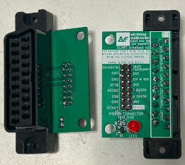
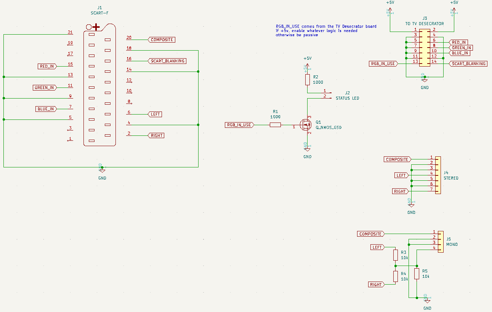

# Simple SCART Breakout Board

*(Old picture, too lazy to take a new one.)*

This is the "production ready" version of the SCART breakout board for the [TV Desecrator](https://github.com/wurthless-elektroniks/tv-desecrator/).

## Bill of materials

Required:
* SCART female connector, vertical (NOT designed for right-angle connectors)
* 14-pin ribbon cable connector, 2x7, 2.54mm spacing

For the status LED (optional):
* LED1: standard 5mm LED
* Q1: NPN or NMOS transistor, SOT-23, B/E/C pinout
* R1: Transistor drive current limiting resistor, 0603, 1k ohms typical
* R2: LED current limiting resistor, 0603, 220-1k ohms typical, 1k recommended

If you want stereo audio:
* Stereo connector: JST B7B-PH-K-S
* Cable used: JST 07KR-6S-P

If you want mono audio:
* R3, R4: 0805 resistors that mix outputs to mono channel
* R5: 0805 resistor, pulldown to ground
* Mono connector: JST B4B-PH-K-S
* Cable used: JST 04KR-6S-P

Actual values of mono mix resistors subject to your own experimentation.

## Boring Ass Schematic

## Ribbon connector pinout

Straight from the TV Desecrator docs:

| Fcn        | Pin | Pin | Fcn            |
| ---------: | --: | :-- | :------------- |
|        +5V |   1 | 2   | +5V            |
|        GND |   3 | 4   | GND            |
|        GND |   5 | 6   | RED            |
|        GND |   7 | 8   | GREEN          |
|        GND |   9 | 10  | BLUE           |
|        GND |  11 | 12  | GND            |
| RGB IN USE |  13 | 14  | SCART BLANKING |

where:

* +5V is 5VDC from the TV Desecrator's 5 volt regulator
* GND is chassis ground
* RED/GREEN/BLUE are 0.7 Vpp, 75-ohm terminated RGB video signals
* RGB IN USE is a 5 volt TTL signal, active high, indicating that the TV Desecrator is pulling RGB video from this connector. This signal will
  toggle when the OSD is running, so any logic relying on this pin should have a timeout mechanism so that it stays active.
* SCART BLANKING is exactly what it says on the tin. This is a 75-ohm terminated input, and once the pulldown has been applied, the TV Desecrator
  needs to see a certain voltage (ideally 1VDC) present on this pin before it can inject RGB. **Do NOT directly supply 5V to this pin** -- use a 470 ohm
  resistor.

This connector is designed so that, in the future, the breakout board can perform additional tasks if needed. I had sync stripping in
mind when I did this. However it's entirely possible that breakout boards can be daisy chained together.

## License

Public domain
